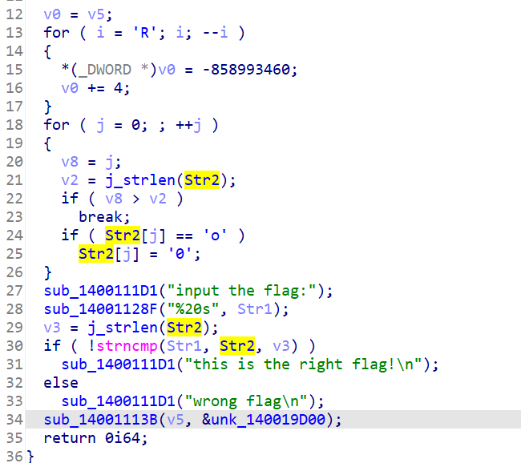

- BUUCTF Reverse 刷题
# easyre | 入门级
- 方法一：WinHex 打开 easyre.exe，浏览一下字符串，发现有flag
- 方法二：IDA Pro 打开 easyre.exe，能直接看到flag，或者 F5 反汇编看到逻辑是输入两个相同的整数就输出 flag，或者 shift+F12 打开字符串常量窗口，比 WinHex 方便一点浏览字符串。

# reverse_1 | 入门级
函数列表找不到名称带有 main 的函数。看字符串也看不到 flag，但没关系，能看到 wrong flag 和 this is right flag 的提示信息，进入对应函数，F5 反汇编。

- strncmp(Str1, Str2, v3): 比较 Str1 和 Str2 的前 v3 个字节(char)。
- Str1 是 {hello_world}，下面的逻辑是把 Str1 的 o 替换为 0，即得到 flag。

